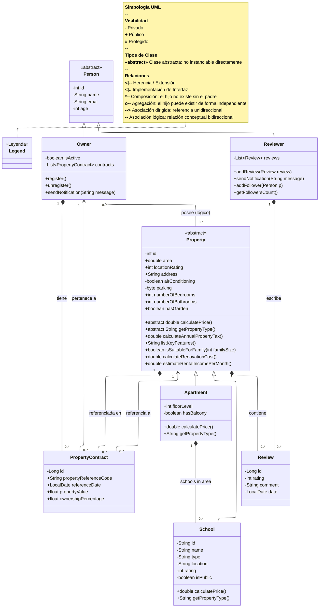

# Technical Documentation: Apartment Predictor, a Real Estate Management System — UML v1

---

## Notas de diseño — V1

- **`School`** hereda de `Property` y se relaciona con `Apartment` mediante composición (1 Apartment → 0..* Schools). Representa los centros educativos del área de referencia del apartamento, dato clave para la analítica futura (V2).
- **`Person`** es abstracta: no se instancia directamente. `Owner` y `Reviewer` son sus únicas especializaciones en V1.
- **`Property`** es abstracta: el único subtipo concreto en V1 es `Apartment`. Subtipos como `House`, `Duplex` y `Townhouse` se incorporarán en V2.
- **`PropertyContract`** (antes `Ownership`) es la entidad de unión que resuelve la relación muchos-a-muchos entre `Owner` y `Property`, almacenando atributos propios del contrato (valor, porcentaje, fecha).
- **`Review`** es propiedad tanto de `Property` (composición física) como de `Reviewer` (composición autoral). Ambas composiciones son válidas: una `Review` no existe sin su propiedad ni sin su autor.
- Las **interfaces** (`Registrable`, `Notifiable`, `Followable`) y las clases `SingleFamilyHome`, `House`, `Duplex`, `Townhouse` y `Analytics` quedan diferidas para V2.
- La **asociación lógica** `Owner -- Property` se mantiene como referencia conceptual; la persistencia real se gestiona exclusivamente a través de `PropertyContract`.